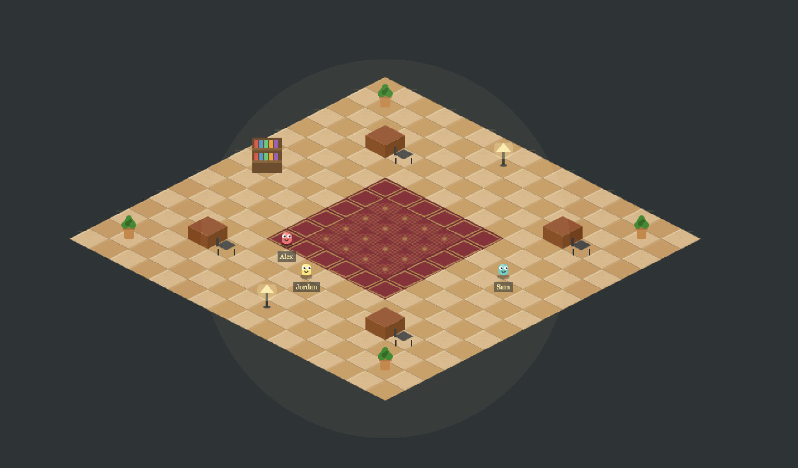

# Work Farm

A terminal-based AI agent orchestration system. Hire autonomous agents, give them goals, and let the adversary-worker architecture handle the rest.



## Concept

Work Farm treats AI as labor, not a chat interface. You are the **steward** of a small team of AI agents who:

- Accept high-level goals ("make this codebase faster", "add authentication")
- Scout codebases autonomously before planning
- Execute multi-step plans with full tool access
- Report back, ask questions when stuck, and learn your preferences

The system uses an **adversary-worker architecture**: a no-tools LLM orchestrator (the adversary) directs Claude Code workers that have full tool access. The adversary plans, evaluates, refines, and manages — the workers execute.

## Features

- **Goal-driven execution** - Describe what you want, not how to do it
- **Adversary-worker architecture** - LLM orchestrator (no tools) directs Claude Code workers (full tools)
- **Recon phase** - Workers scout codebases before the adversary creates a plan
- **Adaptive planning** - Plans are refined after each step based on results
- **Auto-answering** - Adversary tries to unblock workers before escalating to you
- **Preference learning** - System remembers your choices across sessions
- **Parallel agents** - Run multiple agents on different goals simultaneously
- **Background execution** - Workers run silently; check progress with `status`

## Installation

```bash
# Clone the repo
git clone https://github.com/yourusername/workfarm.git
cd workfarm

# Install dependencies
npm install

# Build the TUI
npm run build:tui

# Run
node dist-tui/tui/index.js
```

## Usage

### Quick Start

```bash
workfarm> hire sal
  Hired sal

workfarm> goal sal --dir /path/to/project optimize the database queries
  Goal created for sal: optimize the database queries

workfarm> wake sal
  Waking sal for goal: optimize the database queries
[Adversary] Scouting codebase before planning...
[Adversary] Recon complete, generating informed plan...
[Adversary] Plan created: 4 steps, recurring=false
[Adversary] Crafting instruction for step 1: Profile slow queries...
```

### Checking Progress

```bash
workfarm> status sal

  Goal: optimize the database queries
  Status: active
  Working directory: /path/to/project
  Plan (4 steps):
    ✓ Step 1: Profile database queries to identify slow endpoints
      Result: Found 3 N+1 queries in /api/users, /api/posts, /api/comments...
    → Step 2: Add eager loading to resolve N+1 queries
    ○ Step 3: Add database indexes on frequently queried columns
    ○ Step 4: Benchmark and compare with baseline
```

### When Agents Need Help

```bash
  ** sal needs input **
  Found both PostgreSQL and Redis in the project. Which should I optimize?

  Use: reply sal <your answer>

workfarm> reply sal Focus on PostgreSQL
  Sending reply to sal...
```

### Talking to Agents

```bash
workfarm> talk sal what's the progress so far?
  Completed profiling (step 1) which found 3 N+1 queries consuming 850ms.
  Currently fixing them with eager loading. Two more steps after this.
```

### Multiple Agents

```bash
workfarm> hire alice
workfarm> goal alice --dir /path/to/frontend add dark mode support
workfarm> wake alice

workfarm> status
  sal: optimize the database queries [active]
  alice: add dark mode support [active]
```

## Commands

| Command | Description |
|---------|-------------|
| `hire [name]` | Hire a new agent |
| `fire <agent>` | Fire an agent and clean up |
| `agents` | List all agents |
| `goal <agent> [--dir <path>] <desc>` | Create a goal |
| `goals [agent]` | List goals |
| `wake <agent>` | Start goal execution |
| `pause <agent>` | Pause goal execution |
| `status [agent]` | Show progress (all agents or detailed view) |
| `talk <agent> <message>` | Chat with agent about progress |
| `reply <agent> <answer>` | Answer an agent's question |
| `approve <agent> <tool>` | Approve a tool permission |
| `deny <agent>` | Deny pending permissions |
| `plan <agent>` | Show current plan details |
| `constrain <agent> <text>` | Add constraint to active goal |
| `prompt <agent> <text>` | Set agent system prompt |
| `prefs <agent>` | Show learned preferences |
| `forget <agent> <key>` | Remove a preference |
| `log <agent> [n]` | Show last N events |
| `schedule <agent> <minutes>` | Set recurring trigger |
| `unschedule <agent>` | Remove triggers |
| `workspace [add\|remove\|list] [path]` | Manage workspace roots |

## Architecture

```
User
 │
 ├─ goal "make it fast"
 ├─ wake
 │
 ▼
┌──────────────────────────────────────────┐
│            Adversary Agent               │
│         (LLM, no tools)                  │
│                                          │
│  1. Dispatch recon worker ──────────┐    │
│  2. Generate plan from recon        │    │
│  3. Craft step instructions ──────┐ │    │
│  4. Evaluate results (PASS/RETRY) │ │    │
│  5. Refine remaining plan         │ │    │
│  6. Auto-answer questions         │ │    │
│  7. Escalate to user if needed    │ │    │
└───────────────────────────────────┼─┼────┘
                                    │ │
                                    ▼ ▼
                            ┌──────────────┐
                            │    Worker    │
                            │ (Claude Code) │
                            │  Full tools   │
                            │  File I/O     │
                            │  Bash         │
                            │  Search       │
                            └──────────────┘
```

### Execution Flow

1. **Recon** - Worker scouts codebase, produces structured report
2. **Plan** - Adversary creates concrete plan from recon findings
3. **Execute** - For each step:
   - Adversary crafts contextualized instruction (worker has no memory between steps)
   - Worker executes with full tool access
   - Adversary evaluates: PASS (continue) / RETRY (refine instruction) / ESCALATE (ask user)
4. **Refine** - After each PASS, adversary checks if remaining steps need updating
5. **Complete** - All steps pass, goal marked done

## Tech Stack

- **TypeScript** - Type-safe code throughout
- **Claude Code CLI** - Worker execution (full tool access)
- **Claude CLI (`--tools ""`)** - Adversary LLM (no tools, planning only)
- **Node.js** - Runtime

## Project Structure

```
workfarm/
├── src/
│   ├── tui/
│   │   └── index.ts              # Terminal UI + REPL
│   ├── control/
│   │   ├── AdversaryAgent.ts     # Orchestrator (plan, evaluate, refine)
│   │   ├── LLMClient.ts         # No-tools LLM interface via Claude CLI
│   │   ├── ClaudeCodeBridge.ts   # Worker session management
│   │   ├── GoalManager.ts       # Goal + plan state
│   │   ├── AgentManager.ts      # Agent lifecycle
│   │   ├── TaskManager.ts       # Task tracking
│   │   ├── PreferenceManager.ts # Learned user preferences
│   │   ├── TriggerScheduler.ts  # Recurring goal scheduling
│   │   ├── NodeAdapter.ts       # Claude CLI process spawning
│   │   ├── SessionManager.ts    # Active session tracking
│   │   └── EventBus.ts          # Event system
│   ├── observe/
│   │   └── ObservabilityModule.ts
│   └── types/
│       └── index.ts
├── tsconfig.tui.json
└── package.json
```

## Requirements

- Node.js 18+
- Claude Code CLI installed and authenticated (`claude` command available)

## License

MIT
